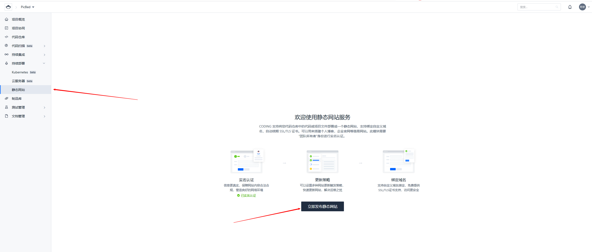
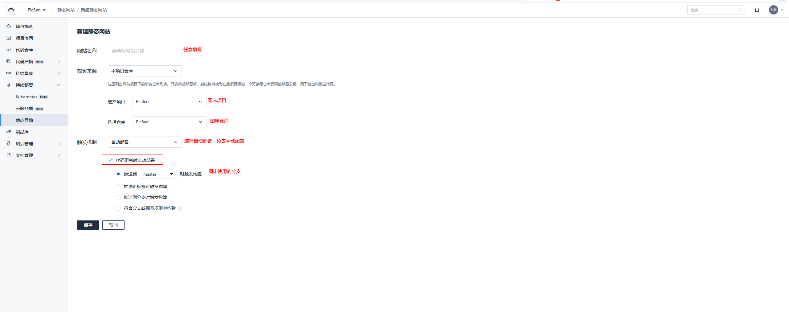
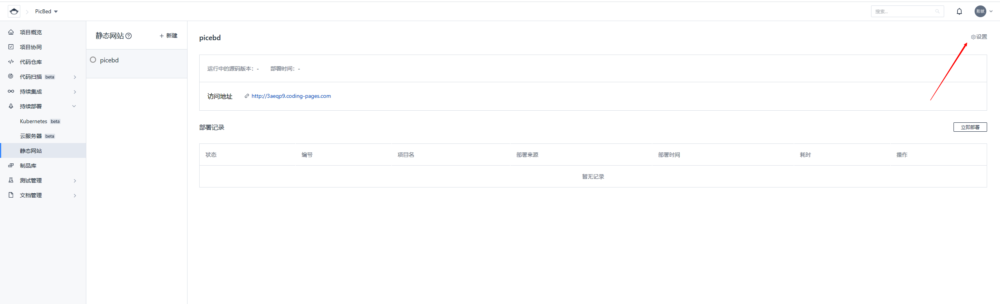
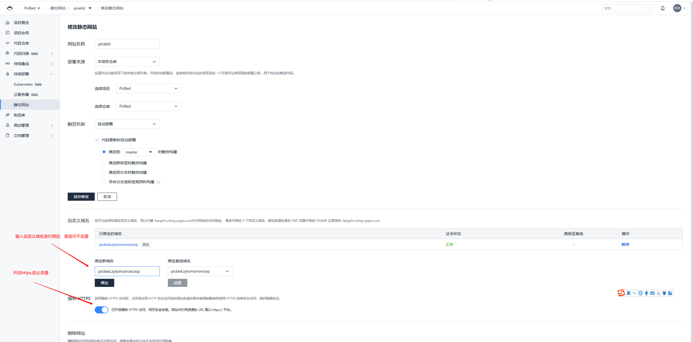
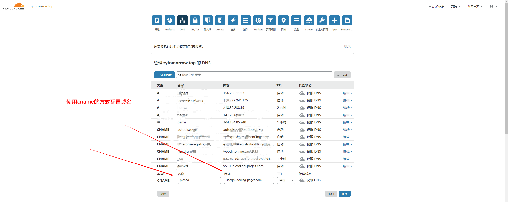

# picgo-plugin-Coding

PicGo Uploader For Coding.net

### Install

```bash
npm i picgo-plugin-coding
```

### Usage

- 团队名称: coding.net团队名称
- 项目名称: 需要保存图片的库名
- token: coding.net's api token
- 分支: 需要存放图片的分支。默认master
- 存储文件夹: 需要存放照片的指定文件夹
- 按年月日存放: 图片自动按日期路径存放与库中，可以存储文件夹混合使用
- 自定义域名: 开启coding pages后的自定义域名，可不选

### coding pages配置
1. 在项目的设置中开启持续部署
   
2. 配置持续部署，选择静态网站
   
3. 配置静态网站设置
   
4. 配置自定义域名，建议开启https。需要在自己的域名DNS处配置CNAME访问
   
   
   
5. 首次需要手动触发部署，之后每次上传图片会自动触发部署，每次部署耗时约在15s以内，所以直接在md里写文档的话，图片显示略有延迟
   


### Demo

