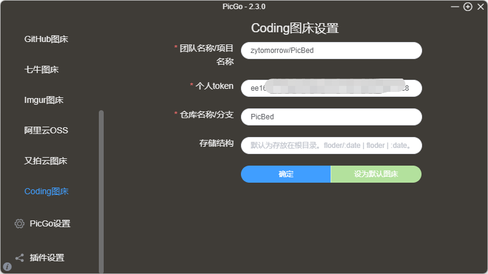

# picgo-plugin-Coding

PicGo Uploader For Coding.net

### Install

```bash
npm i picgo-plugin-coding
```

**考虑到coding API变更，现在使用的模拟浏览器的方式进行的授权，存在一定性能损耗。
由于使用到puppeteer,不想安装完整puppeteer小伙伴可以考虑使用 [picgo-plugin-coding-lite](hhttps://github.com/zytomorrow/picgo-plugin-coding/tree/lite)**

### Usage
- 团队名称/项目名称: coding.net团队名称/项目名称
- 登录手机号或邮箱: coding.net的登录手机号或者邮箱
- 密码: coding.net的登录密码
- 仓库名称/分支: 填入仓库名和分支。可只填仓库名
- 存储结构: 默认不填为存放在根目录。floder/:date | floder | :date。floder为自定义文件夹名
- 自定义域名: 开启coding pages后的自定义域名，可不选。`后期pages迁移了后会产生CDN费用，请注意`

### coding pages配置
1. 在项目的设置中开启持续部署
   
2. 配置持续部署，选择静态网站
   
3. 配置静态网站设置
   
4. 配置自定义域名，建议开启https。需要在自己的域名DNS处配置CNAME访问
   
   
   
5. 首次需要手动触发部署，之后每次上传图片会自动触发部署，每次部署耗时约在15s以内，所以直接在md里写文档的话，图片显示略有延迟
   


### Demo

